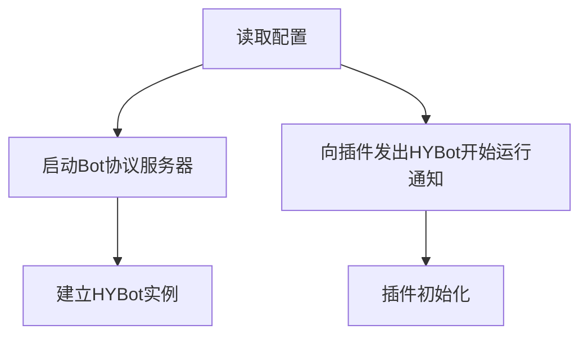
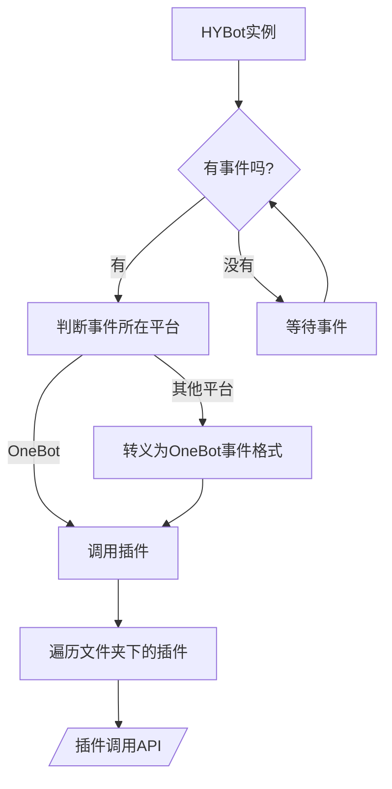
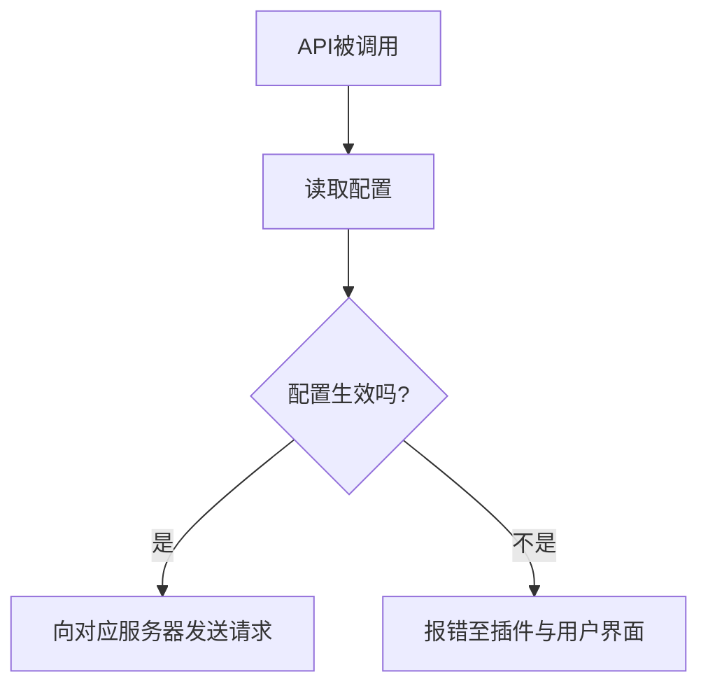

# HYBot 运行周期

HYBot 启动运行周期：

```mermaid
graph TD;
读取配置-->启动Bot协议服务器;
    读取配置-->向插件发出HYBot开始运行通知
    向插件发出HYBot开始运行通知-->插件初始化
    启动Bot协议服务器-->建立HYBot实例;
```

HYBot 实例的运行周期：

```mermaid
graph TD;
    HYBot实例-->m{有事件吗?};
    m--有-->c[判断事件所在平台];
    c--OneBot-->p[调用插件];
    c--其他平台-->t[转义为OneBot事件格式];
    t-->p;
    p-->g[遍历文件夹下的插件];
    g-->a[/插件调用API/]
    m--没有-->等待事件;
    等待事件-->m;
```

HYBot API 的运行周期：

```mermaid
graph TD;
    API被调用-->读取配置;
    读取配置-->i{配置生效吗?};
    i--是-->p[向对应服务器发送请求];
    i--不是-->e[报错至插件与用户界面];
```

